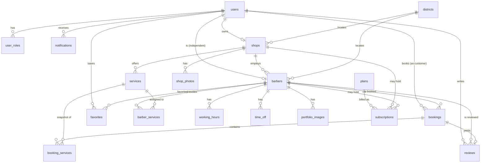

# Sapor — Data Model & ERD (PostgreSQL)

## Design principles

1. **The bookable unit is always a `barber`.** A shop owns barbers; an independent barber owns themselves. The `bookings`, `availability`, and `services` tables reference `barber_id` and never branch on provider type. This is the single most important modeling decision.
2. **One `users` table, roles via a join.** A person can be a customer and a provider. Auth lives on `users`; capabilities come from `user_roles`.
3. **Money and durations are integers.** Prices in **AMD minor units? No** — AMD has no minor unit in practice, so store `price_amd INTEGER` (whole drams). Durations in **minutes** (`smallint`). Never floats for money.
4. **All timestamps `timestamptz`, stored UTC.** Display in `Asia/Yerevan` (UTC+4, no DST). Working-hours are stored as local clock times (`time`) + a weekday, interpreted in the provider's timezone.
5. **Soft delete via `deleted_at`** on user-facing entities so history (bookings, reviews) stays intact.
6. **UUID primary keys** (`gen_random_uuid()` from `pgcrypto`) — avoids leaking counts and eases future sharding.

## ERD (Mermaid)



## ERD diagram description (prose, for slides/docs)

At the center sits **`bookings`**, each pointing to one **customer** (`users`) and one **`barbers`** row, with a snapshot of the chosen services in **`booking_services`**. A **`barber`** is either linked to a **`shop`** (employed) or to a **`user`** directly (independent) — never both. Around `barbers` orbit the scheduling tables: **`working_hours`** (recurring weekly template), **`time_off`** (one-off blocks/holidays), and the derived availability that the API computes on the fly. **`services`** belong to a shop or an independent barber and are linked to the barbers who perform them through **`barber_services`** (which can override price/duration per barber). **`reviews`** hang off completed `bookings`. **`plans`/`subscriptions`** (Phase 2) attach billing to a shop or barber. **`districts`** is a small lookup that locates shops and barbers for filtering.

## Core tables (MVP)

### users
| column | type | notes |
|--------|------|-------|
| id | uuid PK | `gen_random_uuid()` |
| email | citext UNIQUE | case-insensitive |
| password_hash | text | nullable if OAuth-only (P2) |
| full_name | text | |
| phone | text | nullable; E.164 |
| phone_verified | boolean | default false (P2) |
| email_verified | boolean | default false |
| avatar_url | text | nullable |
| status | text | `active` \| `suspended`; check constraint |
| created_at / updated_at | timestamptz | |
| deleted_at | timestamptz | nullable (soft delete) |

### user_roles
| column | type | notes |
|--------|------|-------|
| user_id | uuid FK→users | |
| role | text | `customer` \| `barber` \| `shop_owner` \| `admin` |
| PK | (user_id, role) | a user can hold several |

### districts (lookup)
| column | type | notes |
|--------|------|-------|
| id | smallint PK | |
| name_hy / name_en | text | e.g. Կենտրոն / Kentron |
| slug | text UNIQUE | |

### shops
| column | type | notes |
|--------|------|-------|
| id | uuid PK | |
| owner_user_id | uuid FK→users | role must include `shop_owner` |
| name | text | |
| slug | text UNIQUE | public URL |
| description | text | |
| logo_url | text | |
| district_id | smallint FK→districts | |
| address | text | free text |
| lat / lng | numeric(9,6) | nullable; for P2 map |
| phone | text | |
| instagram | text | nullable |
| status | text | `pending` \| `active` \| `suspended` |
| created_at / updated_at / deleted_at | timestamptz | |

### barbers
| column | type | notes |
|--------|------|-------|
| id | uuid PK | |
| shop_id | uuid FK→shops | **nullable** — null = independent |
| user_id | uuid FK→users | nullable; set for independents and for barbers who have a login. A shop-managed barber without a login has null user_id. |
| display_name | text | |
| slug | text UNIQUE | |
| bio | text | |
| experience_years | smallint | |
| photo_url | text | |
| district_id | smallint FK→districts | independents set their own; shop barbers default to shop's |
| timezone | text | default `Asia/Yerevan` |
| slot_granularity_min | smallint | default 15 — slot grid size |
| default_buffer_min | smallint | default 0 — gap after each booking |
| is_verified | boolean | default false (P2 badge) |
| status | text | `pending` \| `active` \| `suspended` |
| rating_avg | numeric(2,1) | denormalized, updated on review |
| rating_count | integer | denormalized |
| created_at / updated_at / deleted_at | timestamptz | |

> **Constraint:** `CHECK (shop_id IS NOT NULL OR user_id IS NOT NULL)` — a barber is owned by a shop or a user (or both: a shop barber who also logs in).

### services
| column | type | notes |
|--------|------|-------|
| id | uuid PK | |
| shop_id | uuid FK→shops | nullable |
| owner_barber_id | uuid FK→barbers | nullable (independent's own catalog) |
| name | text | e.g. "Men's haircut", "Beard trim" |
| description | text | |
| duration_min | smallint | base duration |
| price_amd | integer | whole drams |
| is_active | boolean | |
| created_at / updated_at | timestamptz | |

> **Constraint:** exactly one of `shop_id` / `owner_barber_id` is set.

### barber_services (which barber does which service, with optional overrides)
| column | type | notes |
|--------|------|-------|
| barber_id | uuid FK→barbers | |
| service_id | uuid FK→services | |
| price_amd_override | integer | nullable |
| duration_min_override | smallint | nullable |
| PK | (barber_id, service_id) | |

### working_hours (recurring weekly template)
| column | type | notes |
|--------|------|-------|
| id | uuid PK | |
| barber_id | uuid FK→barbers | |
| weekday | smallint | 0=Mon … 6=Sun |
| start_time | time | local clock |
| end_time | time | local clock |
| — | — | multiple rows per weekday allowed (e.g. split shift with a lunch gap) |

### time_off (one-off unavailable blocks: holidays, vacation, breaks)
| column | type | notes |
|--------|------|-------|
| id | uuid PK | |
| barber_id | uuid FK→barbers | |
| starts_at | timestamptz | |
| ends_at | timestamptz | |
| reason | text | nullable |
| — | EXCLUDE constraint | optional: prevent overlapping time_off per barber via `tstzrange` + gist |

### bookings
| column | type | notes |
|--------|------|-------|
| id | uuid PK | |
| customer_user_id | uuid FK→users | |
| barber_id | uuid FK→barbers | |
| shop_id | uuid FK→shops | nullable; denormalized for shop dashboards |
| starts_at | timestamptz | |
| ends_at | timestamptz | = starts_at + total duration (+ buffer excluded from ends_at; buffer enforced separately) |
| status | text | `requested` \| `confirmed` \| `cancelled` \| `completed` \| `no_show` |
| total_price_amd | integer | snapshot sum |
| total_duration_min | smallint | snapshot sum |
| customer_note | text | nullable |
| cancel_reason | text | nullable |
| cancelled_by | text | nullable: `customer` \| `provider` \| `system` |
| created_at / updated_at | timestamptz | |

> **Double-booking prevention (the critical constraint):**
> ```sql
> ALTER TABLE bookings ADD CONSTRAINT no_overlap_per_barber
>   EXCLUDE USING gist (
>     barber_id WITH =,
>     tstzrange(starts_at, ends_at) WITH &&
>   ) WHERE (status IN ('requested','confirmed'));
> ```
> This makes Postgres itself reject any overlapping active booking for the same barber — the database is the source of truth, immune to application race conditions. Requires the `btree_gist` extension.

### booking_services (snapshot of chosen services)
| column | type | notes |
|--------|------|-------|
| booking_id | uuid FK→bookings | |
| service_id | uuid FK→services | nullable (kept for analytics; snapshot below is source of truth) |
| name_snapshot | text | name at time of booking |
| price_amd_snapshot | integer | |
| duration_min_snapshot | smallint | |
| PK | (booking_id, service_id) | |

### reviews
| column | type | notes |
|--------|------|-------|
| id | uuid PK | |
| booking_id | uuid FK→bookings UNIQUE | one review per booking |
| barber_id | uuid FK→barbers | denormalized |
| customer_user_id | uuid FK→users | |
| rating | smallint | CHECK 1..5 |
| comment | text | nullable |
| is_hidden | boolean | admin moderation |
| created_at | timestamptz | |

### portfolio_images / shop_photos
| column | type | notes |
|--------|------|-------|
| id | uuid PK | |
| barber_id / shop_id | uuid FK | |
| url | text | object-storage URL |
| sort_order | smallint | |
| created_at | timestamptz | |

### notifications
| column | type | notes |
|--------|------|-------|
| id | uuid PK | |
| user_id | uuid FK→users | |
| type | text | `booking_created`, `booking_confirmed`, `booking_cancelled`, `reminder`, `review_request` |
| payload | jsonb | denormalized data for rendering |
| channel | text | `email` \| `inapp` (P2: `telegram`,`push`,`sms`) |
| read_at | timestamptz | nullable |
| sent_at | timestamptz | nullable |
| created_at | timestamptz | |

### favorites (P2)
| column | type | notes |
|--------|------|-------|
| user_id | uuid FK→users | |
| barber_id | uuid FK→barbers | |
| PK | (user_id, barber_id) | |

## Phase 2+ tables (billing)

### plans
`id, code (free/pro), name, price_amd_month, features jsonb, is_active`

### subscriptions
`id, shop_id (nullable), barber_id (nullable), plan_id, status (active/past_due/cancelled), current_period_start, current_period_end, created_at` — exactly one of shop_id/barber_id set.

### featured_placements (P2)
`id, barber_id|shop_id, district_id (nullable=global), starts_at, ends_at, priority` — drives search ranking boosts.

## Indexes that matter

- `bookings (barber_id, starts_at)` — availability computation and provider agenda.
- `bookings (customer_user_id, starts_at DESC)` — customer history.
- GiST exclusion index from the no-overlap constraint (also serves overlap lookups).
- `barbers (district_id, status)` and `barbers (rating_avg DESC)` — discovery filters/sort.
- `working_hours (barber_id, weekday)`.
- `services (shop_id)`, `services (owner_barber_id)`.
- Full-text or `pg_trgm` index on `barbers.display_name`, `shops.name` for search **[P2]**.

## How availability is derived (not stored)

There is **no "available slots" table**. Availability is computed at query time from:

```
available(barber, day) =
    working_hours(barber, weekday)            // recurring template
  − time_off(barber) overlapping the day      // holidays/breaks/vacation
  − bookings(barber) overlapping the day       // status in (requested, confirmed)
  − buffers (default_buffer_min after each booking)
  then sliced into slots of size = max(slot_granularity, requested service duration)
```

Caching the computed result in Redis (short TTL, invalidated on write) keeps it fast. Details and pseudocode in `03-architecture-and-api.md`.
