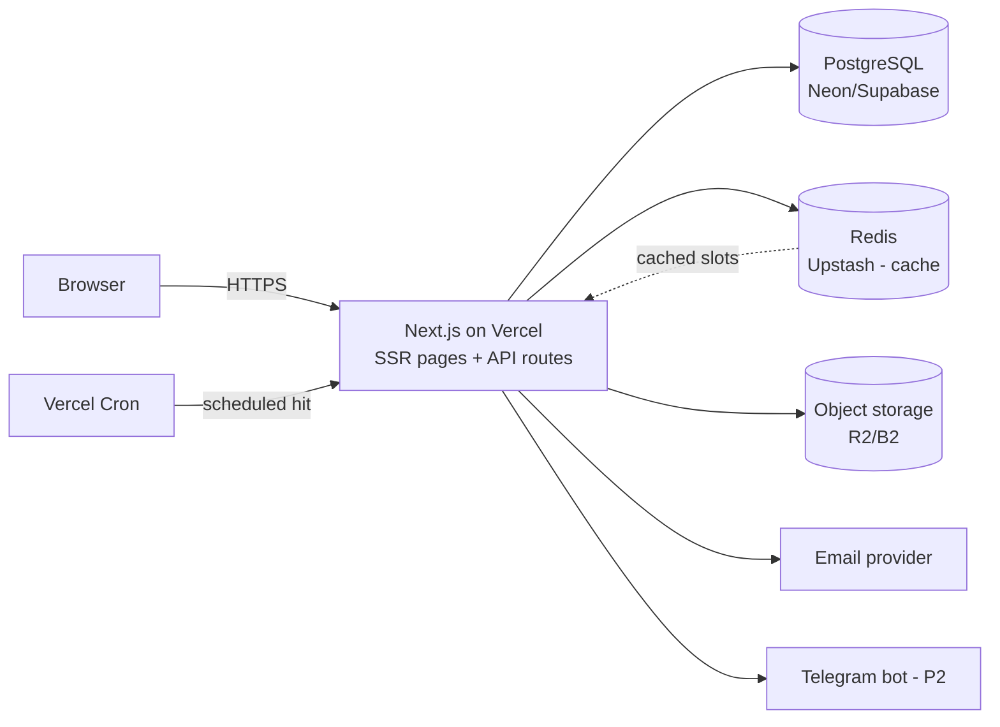

# Sapor — Technical Architecture & API

## 1. Recommended tech stack

Decision: **Next.js full-stack** (UI + API in one project) with **pnpm**, hosted on **Vercel** to start. SSR/SSG gives crawlable barber/shop profiles — important for a discovery marketplace.

| Layer | MVP choice | Notes |
|-------|-----------|-------|
| App | **Next.js (App Router) + TypeScript + SCSS** | UI as Server/Client Components; backend as **Route Handlers** (`app/api/**/route.ts`) and Server Actions. **RTK Query** (Redux Toolkit) for client data fetching/caching, React Hook Form + Zod for forms (Zod schemas shared with the API). SCSS via Next's built-in Sass support. |
| API | **Next.js Route Handlers** | Same project. Keep business logic in `packages/` services (framework-agnostic) so it's testable and portable if you split the API out later. |
| ORM | **Prisma** | Best TS DX + easy migrations. Lives in `packages/db`. Note: the no-overlap exclusion constraint is added via a **raw SQL migration** (Prisma doesn't model GiST exclusion natively). |
| DB | **PostgreSQL 15+** | Needs `pgcrypto`, `btree_gist`, optionally `pg_trgm`, `citext`. Use Neon (Vercel's native Postgres) or Supabase. |
| Cache | **Redis (Upstash)** | Serverless Redis over HTTP — works inside Vercel functions. Availability cache + rate limiting. |
| Jobs | **Vercel Cron → API route** (MVP) | No long-running worker on Vercel; a cron route polls due reminders. **BullMQ worker** only when you move to a VPS (§9). |
| Auth | **Own JWT in Next.js for MVP** | `jose` for signing/verifying, argon2 hashing. Short-lived access token + refresh token in an httpOnly cookie. **Auth0 deferred** — see §6. |
| Storage | **Object storage (S3-compatible)** | Cloudflare R2 (no egress fees) or Backblaze B2 for photos/portfolio; serve via CDN. Upload via presigned URLs. |
| Email | **Transactional email free tier** | e.g. Resend / Brevo / Mailgun free tier. |
| Package mgr | **pnpm** (workspaces) | Strict, content-addressed `node_modules` (no phantom deps); fast; Vercel auto-detects `pnpm-lock.yaml`. |
| Container | **Docker + docker-compose** | Local Postgres + Redis only. Vercel builds the app itself — no app container needed in prod yet. |
| CI | **GitHub Actions** | Lint, typecheck, test. Vercel handles preview + prod deploys on push. |

Shared types live in `packages/shared` (Zod schemas → inferred TS types used by UI and API) — one source of truth for request/response shapes.

## 2. Low-budget hosting (Vercel-first; target ~$0–25/mo at MVP)

> Verify current free-tier limits/prices before committing — these change often.

**Phase A — Vercel-first (now):**
- **App (Next.js):** Vercel free (Hobby) tier — auto deploys from GitHub, preview URLs per PR, pnpm auto-detected. Connect the custom domain in Vercel.
- **Domain:** **barber-shop.am** registered at name.am (~$24/yr). Point DNS at Vercel (A/CNAME records Vercel provides). On hosting: name.am runs **cPanel/LiteSpeed**, and its *paid* plans (~$5–21/mo) list Node.js support — so they *can* run a Node/Next.js app via Passenger. But deploy on **Vercel** anyway: shared cPanel means manual builds, no git-push deploys/preview URLs, and no clean home for Redis or the reminder cron. The **free** bundled plan (600 MB SSD, 30 GB bandwidth, no SSH, no add-on domains, no email) is suitable only for a static "coming soon" page, not the app. name.am accepts Idram/ArCa/Visa — relevant for the Phase 3 payments work — and gifts a `.հայ` domain for 1 dram you can redirect to the site.
- **Database:** Neon (Vercel-native Postgres integration) or Supabase free tier — both support the required extensions.
- **Redis:** Upstash free tier (serverless, HTTP — safe to call from Vercel functions).
- **Object storage:** Cloudflare R2 free tier (no egress fees — important for image-heavy profiles), presigned-URL uploads.
- **Email:** free transactional tier (Resend/Brevo/Mailgun).
- **Reminders:** Vercel Cron (a scheduled route) — no separate server needed.
- **Notifications without SMS cost:** email + in-app, plus a **Telegram bot** (free) for providers — widely used in Armenia. SMS only in Phase 3.

This keeps you near **$0/mo + ~$24/yr domain** to validate.

**Phase B — VPS (if/when you outgrow Vercel or want the BullMQ worker, websockets, or cost control):** one Hetzner VPS (~€4/mo) running `docker-compose` (Next.js + Redis + a BullMQ worker + Caddy for TLS), keeping managed Postgres. Because business logic lives in `packages/`, moving off Vercel is a deploy change, not a rewrite.

**Watch-outs on Vercel free tier:** serverless function timeouts (keep availability/booking handlers fast), cron frequency limits (poll reminders every few minutes, not every second), and cold starts. None block an MVP.

## 3. System architecture (MVP)



One Next.js deployment serves SSR pages **and** API routes. Reminders run via **Vercel Cron** hitting a protected `/api/cron/reminders` route (no separate worker). When you move to a VPS (Phase B), a BullMQ worker replaces the cron route for delayed jobs.

## 4. API architecture

REST, JSON, versioned under `/api/v1`. Auth via `Authorization: Bearer <access_token>`; refresh token in httpOnly cookie. Validation with Zod/class-validator. Consistent error envelope:

```json
{ "error": { "code": "SLOT_TAKEN", "message": "That time was just booked.", "details": {} } }
```

Pagination: cursor-based (`?cursor=&limit=`) for lists. All times ISO-8601 UTC.

### 4.1 Endpoint catalog (MVP)

**Auth**
```
POST   /auth/register            { email, password, full_name, role }
POST   /auth/login               { email, password } -> access token (+ refresh cookie)
POST   /auth/refresh             (refresh cookie) -> new access token
POST   /auth/logout
POST   /auth/verify-email        { token }
POST   /auth/forgot-password     { email }
POST   /auth/reset-password      { token, password }
GET    /me                       -> current user + roles
```

**Discovery (public)**
```
GET    /barbers                  ?district=&service=&min_rating=&max_price=&available_on=&q=&sort=&cursor=
GET    /barbers/:slug            -> profile + services + rating + portfolio
GET    /shops                    ?district=&q=&cursor=
GET    /shops/:slug              -> shop + barbers + photos
GET    /districts
GET    /barbers/:id/availability ?from=YYYY-MM-DD&to=YYYY-MM-DD&service_ids=  -> slots
```

**Bookings (customer)**
```
POST   /bookings                 { barber_id, service_ids[], starts_at }  (idempotency-key header)
GET    /bookings                 ?role=customer&status=  -> my bookings
GET    /bookings/:id
POST   /bookings/:id/cancel      { reason }
POST   /bookings/:id/review      { rating, comment }   (only if completed)
```

**Provider (barber / shop_owner)**
```
# Profile
POST   /shops                    create shop
PATCH  /shops/:id
POST   /shops/:id/photos
POST   /shops/:id/barbers        invite/create barber
GET    /shops/:id/barbers

PATCH  /barbers/:id              update own/managed profile
POST   /barbers/:id/portfolio

# Catalog
POST   /services                 { shop_id|owner_barber_id, name, duration_min, price_amd }
PATCH  /services/:id
DELETE /services/:id
PUT    /barbers/:id/services     assign services (+ overrides)

# Schedule
PUT    /barbers/:id/working-hours   [{ weekday, start_time, end_time }]
POST   /barbers/:id/time-off        { starts_at, ends_at, reason }
DELETE /time-off/:id

# Appointments
GET    /provider/bookings        ?barber_id=&from=&to=&status=  agenda/calendar
POST   /bookings/:id/accept
POST   /bookings/:id/reject      { reason }
POST   /bookings/:id/reschedule  { starts_at }
POST   /bookings/:id/complete
POST   /bookings/:id/no-show
```

**Admin**
```
GET    /admin/users             ?q=&status=
POST   /admin/users/:id/suspend
GET    /admin/providers/pending
POST   /admin/shops/:id/approve
POST   /admin/barbers/:id/approve
GET    /admin/reviews           ?flagged=
POST   /admin/reviews/:id/hide
GET    /admin/metrics           signups, bookings(7/30d), GMV, active providers
```

**Notifications**
```
GET    /notifications           ?unread=
POST   /notifications/:id/read
```

### 4.2 Idempotent booking creation
`POST /bookings` accepts an `Idempotency-Key` header. The server persists the key→result so retries (flaky mobile networks) don't create duplicate bookings. Combined with the DB exclusion constraint, this makes booking safe end-to-end.

## 5. Role-based permissions (RBAC)

Roles: `customer`, `barber`, `shop_owner`, `admin`. Enforced by a NestJS guard reading roles from the JWT plus an **ownership check** (you can only edit resources you own).

| Capability | customer | barber | shop_owner | admin |
|------------|:--:|:--:|:--:|:--:|
| Browse, view profiles | ✅ | ✅ | ✅ | ✅ |
| Create booking | ✅ | ✅* | ✅* | ✅ |
| Cancel own booking | ✅ | — | — | ✅ |
| Leave review (own completed booking) | ✅ | — | — | ✅ |
| Edit own barber profile/services/hours | — | ✅ (self) | ✅ (shop's barbers) | ✅ |
| Manage shop, roster, photos | — | — | ✅ (own shop) | ✅ |
| Accept/reject/reschedule booking | — | ✅ (own) | ✅ (shop's) | ✅ |
| Mark complete / no-show | — | ✅ (own) | ✅ (shop's) | ✅ |
| Suspend users, approve providers, moderate reviews, view metrics | — | — | — | ✅ |

\* providers can also act as customers when booking elsewhere.

Two layers everywhere: **(1) role guard** (does this role exist on the token?) and **(2) resource ownership** (`barber.user_id === userId` or `shop.owner_user_id === userId`). Never trust IDs from the client without the ownership check.

## 6. Auth: JWT now, Auth0 later

**MVP = self-hosted JWT** in NestJS: argon2id password hashing, 15-min access token, rotating refresh token in an httpOnly+Secure+SameSite cookie, refresh-token reuse detection. Email verification + password reset via signed, expiring tokens. This costs **$0** and keeps user data in your DB.

**Auth0 (your listed preference)** is a clean drop-in for Phase 2 when you add Google/social login, SMS OTP, and want to offload security. Trade-off: Auth0's free tier covers small MAUs but pricing climbs with users and certain features sit behind paid tiers — verify current limits. Because the API only depends on a verified `userId` + `roles` claim, switching the issuer later is a localized change (swap the token validation strategy; keep guards/ownership intact). **Recommendation:** ship MVP on self-hosted JWT; adopt Auth0 when social/SMS login and compliance offload are worth the cost.

## 7. Appointment scheduling architecture (the core engine)

### 7.1 Availability computation
For a barber and a date range:

```
1. Pull working_hours rows for each weekday in range  -> open intervals (local time -> UTC).
2. Subtract time_off intervals overlapping the range.
3. Subtract existing bookings (status in requested/confirmed),
   each expanded by default_buffer_min on the trailing edge.
4. The remaining free intervals are sliced into candidate start times
   on a grid of slot_granularity_min, keeping only starts where
   [start, start + requested_total_duration] fits entirely inside a free interval.
5. Drop slots whose start is in the past or inside a minimum-lead-time window.
```

This is interval arithmetic — cheap. Pseudocode:

```ts
function availableSlots(barber, day, durationMin): Date[] {
  let free = workingIntervals(barber, day);          // [{start,end}]
  free = subtract(free, timeOffIntervals(barber, day));
  free = subtract(free, bookedIntervals(barber, day, barber.defaultBufferMin));
  const slots: Date[] = [];
  for (const iv of free)
    for (let t = ceilToGrid(iv.start, barber.slotGranularityMin); 
         addMin(t, durationMin) <= iv.end; 
         t = addMin(t, barber.slotGranularityMin))
      if (t > now() + minLead) slots.push(t);
  return slots;
}
```

### 7.2 Preventing double-booking (concurrency)
Two customers can request the same slot at the same instant. Three defenses, in order:
1. **DB exclusion constraint** (`btree_gist` over `barber_id` + `tstzrange`) — the ultimate guarantee; the second insert fails. *This alone is sufficient for correctness.*
2. On constraint violation, the API returns `409 SLOT_TAKEN` and the client refetches availability.
3. Optional Redis short-lived **soft lock** (`SETNX barber:{id}:{slot}`) while the customer is on the confirm screen, to reduce visible collisions — purely UX, not correctness.

### 7.3 Caching
Cache computed availability per `(barber_id, day, duration_bucket)` in Redis with a short TTL (e.g. 60s) and **invalidate on any write** to that barber's bookings/time-off/working-hours. Discovery's "available today" filter reads the cache.

## 8. Calendar management system
- **Provider calendar** = working_hours (recurring template, edited in a weekly grid) + time_off (one-off blocks) + bookings (read-only blocks). The agenda/week views in the dashboard render these three layers.
- **Reschedule** = cancel-and-recreate inside a transaction, re-checking the exclusion constraint.
- **External calendar sync (P2):** one-way iCal feed (`/barbers/:id/calendar.ics`) so providers see Sapor bookings in Google/Apple Calendar; two-way Google sync is P3.

## 9. Notification system design

Event-driven via **BullMQ** (Redis) jobs. The API emits a domain event → a job is enqueued → the worker renders + sends per channel, then writes a `notifications` row.

| Event | Recipient | MVP channel | Later |
|-------|-----------|-------------|-------|
| booking_created (request mode) | provider | email + in-app | Telegram, push |
| booking_confirmed | customer | email + in-app | Telegram, SMS |
| booking_cancelled | both | email + in-app | Telegram, SMS |
| reminder (T-24h / T-2h) | customer | email | SMS (P3) |
| review_request (after complete) | customer | email + in-app | push |

**Reminders — two implementations depending on host:**
- **On Vercel (now):** a **Vercel Cron** job runs every few minutes, calling a protected `/api/cron/reminders` route that queries bookings whose reminder time has passed and that haven't been notified yet (a `reminder_sent_at` column or a `notifications` row guards against double-send). Simple, no extra infra.
- **On a VPS (Phase B):** switch to **delayed BullMQ jobs** scheduled at booking time (`delay = startsAt − 2h`), cancelled if the booking is cancelled — more precise, no polling.

**Channel strategy for Armenia:** email + in-app for MVP; **Telegram bot** in Phase 1 (free, popular); **SMS** only in Phase 3 (per-message cost via a local gateway).

## 10. Security considerations
- argon2id password hashing; never log secrets/tokens.
- Short-lived access JWT + rotating refresh token (httpOnly, Secure, SameSite=Strict); reuse detection.
- Strict input validation (Zod/class-validator) on every endpoint; reject unknown fields.
- RBAC guard **+ ownership check** on every mutating route.
- Parameterized queries via the ORM (no string SQL) → SQL-injection safe.
- Rate limiting (`@nestjs/throttler`) on auth, booking, and review endpoints.
- CORS locked to the web origin; security headers via Helmet.
- File uploads: validate MIME + size, generate randomized keys, serve from object storage (not the API host); strip EXIF.
- Secrets in env vars / a secrets manager — never in the repo. `.env.example` committed, `.env` git-ignored.
- PII minimization: store only what's needed; soft-delete + a real delete path for account deletion.
- HTTPS everywhere (Caddy/Traefik auto-TLS, or platform-managed).
- Audi